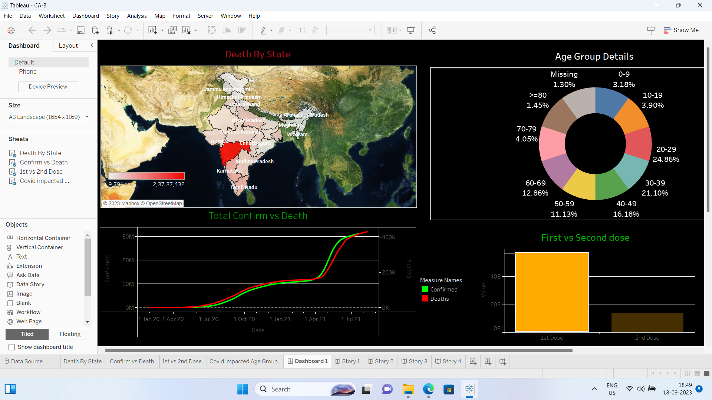

# COVID-19 Data Visualization in Tableau (India)

This project uses Tableau to visualize COVID-19 data for India. It showcases various charts and storytelling techniques to provide insights into the pandemic's impact on confirmed cases, deaths, and recoveries.

## Data Source

The data for this project is sourced from [https://www.kaggle.com/datasets/sudalairajkumar/covid19-in-india] and is regularly updated to maintain accuracy.

## Visualizations

We utilize different chart types for effective data representation:

- **Pie Chart**: Shows the percentage distribution of confirmed cases, deaths, and recoveries.
- **Scatter Plot**: Allows for deeper analysis of the data.
- **Bar Chart**: Provides a visual comparison of different COVID-19 statistics.
- **Bubble Chart**: Visualizes data points with varying sizes for enhanced clarity.
- **Heatmap**: Illustrates data density for specific regions.
- **Map View**: Presents a geographic perspective of COVID-19 cases.
- **Pareto Chart**: Highlights the most significant factors contributing to the pandemic.

## Features

- Interactive visualizations for dynamic exploration.
- Storytelling to guide users through pandemic trends.

## How to Use

To access and explore the visualizations:

1. Clone or download this GitHub repository.
2. Open Tableau workbook and you go !
3. Open the Tableau visualization files using Tableau Desktop or Tableau Public.

## Storytelling

We've incorporated storytelling techniques to provide context and insights into India's COVID-19 pandemic. Navigate through the visualizations and accompanying narratives to gain a deeper understanding of the data.

## Contributing

If you want to contribute to this project:

1. Fork this repository.
2. Create a new branch for your changes.
3. Make your updates and submit a pull request.

## License

This project is licensed under the [MIT] License. See the [LICENSE](LICENSE) file for details.
